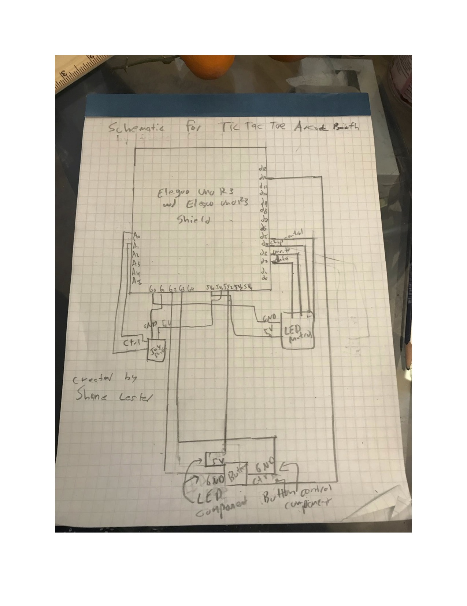

# Arcade Booth System

This repository contains the part list, schematics, and code to reproduce a classic arcade booth. Currently only the game Tic Tac Toe exists in the booth, but an additional menu could be programmed in to add additional games.

## Parts List

- Two 16 by 24 LED chainable matrices produced by Adafruit used as screens and bought [here](https://www.adafruit.com/product/555?gclid=EAIaIQobChMIir6Ykan3wIVAQOGCh3SggV2EAQYAyABEgKsF_D_BwE). This required an external library: a driver to interface between the programming and the hardware downloaded [here](https://github.com/adafruit/HT1632).

- Elegoo Uno R3 produced by Elegoo via their super starter kit bought [here](https://www.elegoo.com/product/elegoo-uno-project-super-starter-kit/).

- Arduino Uno R3 shield found in the Elegoo super starter kit

- 14 short male to male wires found in the Elegoo super starter kit.

- Arcade style 30mm LED button produced by Adafruit to select on screen items and bought [here](https://www.adafruit.com/product/473).
 
- Mini analog joystick, two 10K potentiometers by Adafruit used to scroll through selections and bought [here]( https://www.adafruit.com/product/3102?gclid=EAIaIQobChMIgMrlp-un3wIVgh-GCh1TbghxEAQYASABEgJd__D_BwE).
 
- 9V, 1A generic AC to DC power supply supplied by Tinkersphere used to provide power to the system and bought [here](https://tinkersphere.com/arduino-compatible-components/142-9v-wall-power-adapter-arduino-compatible.html?gclid=EAIaIQobChMIjN__suun3wIVxCaGCh2powcHEAQYAiABEgKCffD_BwE).

-  Perma-Proto Half-sized Breadboard PCB produced by Adafruit and bought [here](https://www.adafruit.com/product/1609?gclid=EAIaIQobChMIuvWR9YWo3wIVB4bICh1qIg2kEAQYAiABEgKI-PD_BwE), used to solder male to male wires from the Elegoo Uno R3 to the mini analog joystick.

- Loose Lego bricks purchased at the Lego store used as a shell for the arcade booth. Two small containers of blue studs size 4 by 2, two large containers of black studs size 6 by 2, and one blue Lego baseplate 32 by 32 studs were used.

## Schematics

## Photos

